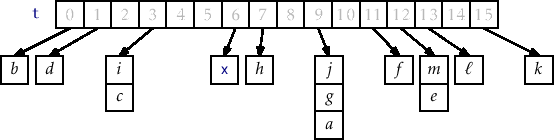

# Hashmaps

Built into the C language are only a mere two data structures: struct and array. And we have previously implemented the queue, stack, and linked list. For this assignment, you are going to implement in the C programming language the hashmap data structure. This data structure is related to other associative data structures you may have used such as a 'map', 'dictionary', or 'hashtable' in other languages.

The hashmap is a key data structure in the compilers and linkers world, because it allows a fast lookup of symbols in a key data structure known as the [symbol table](https://en.wikipedia.org/wiki/Symbol_table). This is important, because when we are linking code together in production, you may be linking 100, 1000, or millions of files together and need to resolve many symbols [How big is a big codebase](https://www.freecodecamp.org/news/the-biggest-codebases-in-history-a128bb3eea73/).

Your implementation of the hashmap data structure will also be linked in as a library. The interface for your functions (i.e. the function declarations) are listed in [./my_hashmap.h](./my_hashmap.h), and the file you will be modifying is [my_hashmap.c](./my_hashmap.c). Functions have been marked TODO for which ones you should implement.

**Refresher** [Video on hashmap](https://www.youtube.com/watch?v=shs0KM3wKv8)

## Hashmaps at a high level



Hash maps go by several other names, such as hash table and dictionary. All of the data structures however are similar (though language libraries may have slightly different gaureentees for each of the data structures). For this assignment however, we are going to implement a chained hash table. That is, you will have several buckets (i.e. arrays indices) for which you can search (i.e. through linked lists).

## Hashmap data structure power

The Hash maps data structure give us on average constant time, insert, update, remove, and find operations. This is incredibly powerful, and gives us yet another data structure in our toolbox to take advantage of. Hashmaps have additional flexibility over a data structure like an array, in that we can use any data type (even custom data types) as a key. For this assignment, we are going to use C-style strings as both our keys and values.

```c
// A key value pair
// This is specifically for a (char*, char*) key value pair
typedef struct pair{
    char* key;
    char* value;
}pair_t;
```

### Hash map in picture form

View below an animation of how items are added and linked together in the hash map.


#### Our implementation

Because we are implementing our hash map as a 'chained' implementation, this means we will have an 'array Of Lists' in our implementation. This means we are allocating an array of pointers (i.e. An array of linked lists).

```c
// Chained implementation of a hashmap
typedef struct hashmap{
    unsigned int buckets;   // i.e. size of the hashmap
    node_t** arrayOfLists;  // An array of linked lists for our buckets
                            // Read another way
                            //      - an array of node_t*

    // A function pointer to a hash function
    // The hash_function must take in a 'char*' as a key, and have a
    // second parameter specifying the number of buckets.
    // Note: function pointers are a new concept, but we can
    //       have pointers to functions just like we can have pointers
    //       to variables. Again, a pointer just stores an address!
    hash_function hashFunction;
}hashmap_t;
```

Note that each of our linked lists in the `arrayOfLists` will point to a node that holds a key/value pair.

```c
// Each node holds a key and a value
typedef struct node{
    struct node* next;
    pair_t* kv;          // 'kv' stands for key/value pair
}node_t;
```

## Designing the algorithms

Each function in this assignment has notes on design in the .c file for implementing the hash map. What may make this assignment particularly difficult is working with 'strings' in C, so I have provided a few notes as well as a sample of what your insert *may* look like (Though you may refactor however you like!). One of the difficulties with passing strings(i.e. char*) around in the C language is making sure your strings get allocated if that is your intent, so this example should shed some insight.

```c
void hashmap_insert(hashmap_t* _hashmap,char* key,char* value){
    if(hashmap_hasKey(_hashmap,key)== ??){
        return;
    }
    // Create a new pair_t
    pair_t* newpair = (pair_t*)malloc(sizeof(pair_t));
    newpair->key    = (char*)malloc(strlen(key)     * sizeof(char));
    newpair->value  = (char*)malloc(strlen(value)   * sizeof(char));
    // Copy the string passed by the user to our node
    strcpy(newpair->key     ,key); 
    strcpy(newpair->value   ,value); 
    // Create a new node
    node_t* newnode = (node_t*)malloc(sizeof(node_t));
    newnode->next = NULL;
    newnode->kv = newpair;

    // Which bucket to search
    unsigned int bucket = _hashmap->???; // Call some function here
    // Create an iterator that points to the head of list for appropriate bucket
    node_t* iter = &_hashmap->arrayOfLists[??];
    //
    // ... Insert node to appropriate linked list
    return;
}
```

### Notes on string operations

- [strcmp](https://www.tutorialspoint.com/c_standard_library/c_function_strcmp)
    - Useful for determinining if two `char*` are equal.
    - An example of how you may use it: 
        - `if(strcmp(iter->kv->key,key)==0)` This is testing if an iterates key/value ('kv') key is equivalent to the one being passed in the function. For example, The hashmap_hasKey function may benefit from this.
- [strcpy](https://www.tutorialspoint.com/c_standard_library/c_function_strcpy)
    - Useful for copying strings passed in as parameters.
    - See the above insert example.

### Containers.h

You will notice another file called [containers.h](./containers.h) where you have a 'pair' and 'node' data type defined for you. By including this header in your other files you can have access to each of these data structures which will be useful in your hashmap implementation.

## Compiling and running the program.

When you have made an attempt at hashmap we will go ahead and compile it as a static object file(a single .o file), and then link it with our main.c program. Remember to save, compile, and test early and often!

* Compile the source code with:
    * `gcc -c my_hashmap.c` (Do this everytime you make modifications to [my_hashmap.c](./my_hashmap.c))
    * `gcc -c main.c` (Do this everytime you make modifications to [main.c](./main.c))
    * `gcc main.o my_hashmap.o -o main_test` (Do this to create the final binary)
* Run the source code with: `./main_test`

# Deliverable

- You only need to modify the file called [my_hashmap.c](./my_hashmap.c) and implement each of the functions. However, it is recommended to add more unit tests to the main.c. We will be testing your program my linking in your version of my_hashmap.o (which is compiled from your my_hashmap.c) to our test suite.
  
# Rubric
   
<table>
  <tbody>
    <tr>
      <th>Points</th>
      <th align="center">Description</th>
    </tr>
    <tr>
      <td>(50%)Hashmap</td>
      <td align="left"><ul><li>There should be no memory leaks</li><li>There should be no bugs in your functions</li><li>Your implementation will be graded by our set of unit tests, and we will check your code 'style' as well.</li></ul></td>
    </tr>
 
  </tbody>
</table> 

# More resources to help

- [Open Data Structures Book on Hashing with Chaining](https://opendatastructures.org/ods-cpp/5_1_Hashing_with_Chaining.html)
- [Hashmap notes](https://www.inf.ed.ac.uk/teaching/courses/inf2b/algnotes/note04.pdf)
- [Function Pointers in C](https://cs.nyu.edu/courses/spring12/CSCI-GA.3033-014/Assignment1/function_pointers.html)

# (Optional) Going Further Task:

(This is an ungraded task--only work on this if you finish the deliverable). You will have to do a little bit of work to figure out how to open and read from files for this task.

- Try implementing additional helper functions for printing all of the values.
