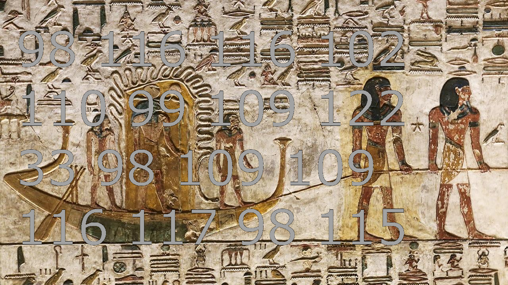

# Assembly Walkthrough

This is an introduction to some of the fundamentals of x86-64 [AT&T assembly](https://en.wikipedia.org/wiki/X86_assembly_language#Syntax) syntax. Please use this as a guide to get up and running with assembly programming! By working through this guide, everyone can leave the class with at least some understanding of programming assembly code.

# Deliverables

1. (**Optional**) Complete each of the C and assembly tutorials in the [./tutorial](./tutorial) directory and commit them when you are finished.
2. (**Optional**) Redo [tool.c](./../../Assignment3_Assembly/part3/tool.c) in your original HW3 repo if you are completing that portion.
3. (**Required**) Fill out this form -- https://forms.gle/DEBEgUbEuKN6Mzuw7


# Introduction



> 98 116 116 102 110 99 109 122 33 98 109 109 116 117 98 115 

*You walk into a room and you find a strange series of numbers written on the wall.*

*10,000 years old the classroom feels like (but actually only about 60 years).*

*You think to yourself, hmm, what a strange series of numbers to be written on a wall.*

*Then you realize the numbers are not strange, you just walked into an ancient computer systems class!*

*These numbers must be in ASCII!*

*You look left, then you look right, and find an empty Unix terminal with 4 programs installed on it.*

*gcc, ld (Loader), as (assembler), and VIM!*

*Time to get to work.*

# Let's C what we are dealing with.

When writing software, we first have to understand the problem we are trying to solve. It's very tempting to immediately start writing code, but first we want to completely understand the problem and then come up with a gameplan of what we want to code. Having a gameplan and structure to our program will be especially important when writing assembly code.

## ASCII Representation of numbers.

Remember that in assembly we only have two real data types: integers and floating point numbers. The data itself may be a different size (a byte, dword, a quadword, etc.), but again we are only working with two different number representations. In (what are considered) higher level languages like 'C' (in this context), we have a datatype to represent individual characters with `char`. We can then compose a series of characters into a string using an array of characters.

So behind the scenes, numbers are really represented as numbers. The table below shows how individual characters are represented by numerical values in the [ASCII](https://en.wikipedia.org/wiki/ASCII) (American Standard Code for Information Interchange).


# Example 1 - Printing ASCII Characters

Let's start with something we know--how to use the C language. We will then replicate each example in AT&T style assembly.

## C Program

In the example below, we print out two characters in the C language, and then we will repeat the exercise in x86-64 assembly.

Implement the following code in [./tutorial/c1.c](./tutorial/c1.c)

```c
///////////////////////////////////
// Compile: 	gcc c1.c -o c1   //
// Run: 	./c1             //
///////////////////////////////////
#include <stdio.h>

int main(){		// The entry into our program.

    putc(65,stdout);    // 65 is the ASCII value for the letter 'A'
    putc(10,stdout);    // 10 is the ASCII value for the NL line feed.
    			// In both of the 'putc' statements we are also
			// writing our output to the standard output (stdout).

    return 0;
}
```

## New Assembly Concept


### Registers

In assembly we do not have variables. Instead, we have registers. Registers follow a given convention. The first 8 registers typically go by their alias (i.e. %rax instead of %r0). I have listed them below.

- r0 - %rax - Accumulator
- r3 - %rbx - Base register
- r1 - %rcx - Used for cycles (i.e. a loop counter)
- r2 - %rdx - Stores data during input/output operations
- r4 - %rsp - Stores the address of the topmost element in the hardware stack
- r5 - %rbp - Stack frames base
- r6 - %rsi - Source index in string manipulation commands
- r7 - %rdi - Desination index in string manipulation commands
- r8 through r15 - General purpose registers

In AT&T assembly, any value that begins with a '%' sign indicates that a register is being used.

My recommendation is to use registers frequently when possible when first writing assembly code. This makes your code a littl easier to manage.

### System Calls

In assembly we can make calls to functions that are implemented in the operating system. These are called [system calls](https://en.wikipedia.org/wiki/System_call) and are handled by the kernel in the operating system. A system call is invoked by using the [syscall](http://man7.org/linux/man-pages/man2/syscall.2.html) command. Many C language functions are simply wrappers for us to use these system calls, however in assembly we can call them directly. We invoke a particular syscall by putting values into registers representing the system call we want to make, as well as the parameters for that particular syscall. A helpful table [here](https://filippo.io/linux-syscall-table/) lists the x86-64 system calls.

## Assembly Program

Now let's implement the same example above in assembly in [./tutorial/assembly1.s](./tutorial/assembly1.s)

```asm
###############################################
# Assemble:	as assembly1.s -o assembly1.o #
# load:		ld assembly1.o -o assembly1   #
# Run:		./assembly1                   #
###############################################

.global _start

# Here we are reserving one ascii character and storing
# that specific character.
#
# The first part (e.g. .character.A:) is a label
# Any line in assembly that ends with a ':' indiciates
# a label, and we can refer to the location of this label.
#
# The second part (.ascii) is a compiler directive stating
# that we are going to do something with an ascii character.
# Finally we provide the single ascii character.
.character.A:           .ascii "A"
.character.endline:    .ascii "\n"


# Now we are able to start the instructions of our program.
.text

# Program entry
_start:             # int main()

    pushq %rbp      # {
    movq %rsp,%rbp  #

    movq $1, %rax       # putc(65,stdout);
    movq $1, %rdi
    leaq .character.A,%rsi
    movq $1, %rdx
    syscall

    movq $1, %rax       # putc(10,stdout);
    movq $1, %rdi
    leaq .character.endline,%rsi
    movq $1, %rdx
    syscall

    movq $60, %rax      # exit(0);
    movq $0,  %rdi
    syscall

    pop %rbp        # }
```


# Example 2 - Printing the alphabet

In our previous example we could print out one character, but we really want to be able to print out multiple characters. In the example below, we print out each character of the alphabet by printing out each ascii character. We think this could be helpful in mapping each letter to another in the alphabet. This time we will be using a loop to also print the characters out efficiently (i.e. with less lines of code).

## C Program

Implement the following code in [./tutorial/c2.c](./tutorial/c2.c)

```c
////////////////////////////////////////////
// Compile:     gcc c2.c -o c2            //
// Run:     	./c2                      //
////////////////////////////////////////////
#include <stdio.h>

int main(){
	int i;   // counting variable for our loop
    	for(i=65; i < 91; i++){
		putc(i,stdout); // Print out the value of 'i'
				// as a character
    	}
    putc(10,stdout);       // Print a new line character
    return 0;
}
```

**Output**
> -bash-4.2$ ./ascii
>
> ABCDEFGHIJKLMNOPQRSTUVWXYZ

## New Assembly Concept

### Jump

We have seen how to loop and print ascii characters in C now are going to now introduce loops in assembly. Unfortunately we do not have a 'looping' construct like a 'for-loop' or 'while-loop' like in C. However, we do have a 'jump' command. Found in the example below is an example of how to perform some conditional logic. We are going to compare a value with a register, and if those values are not equal jump to another line in the program. The line we are jumping to is defined by a label (`.loop:`) in our example.

## Assembly Program

Now let's implement the same example in assembly in [./tutorial/assembly2.s](./tutorial/assembly2.s)

```asm
###############################################
# Assemble:	as assembly2.s -o assembly2.o #
# load:		ld assembly2.o -o assembly2   #
# Run:		./assembly2                   #
###############################################
.global _start

# Set our message in data
.data

    char: .byte 65	# byte = 65

.text

# Program entry
_start:             # int main()

    pushq %rbp      # {
    movq %rsp,%rbp  #

    movq $0, %r15       # initialize our register to 0
.loop:			# do{

    movq $1, %rax       # putc(char,stdout);
    movq $1, %rdi
    leaq char,%rsi
    movq $1, %rdx
    syscall

    incq char		# char = char + 1
    incq %r15		# %r15 = %r15 + 1
    cmpq $26,%r15
    jne .loop		# }while(26!= %r15)

    movq $60, %rax      # exit(0);
    movq $0,  %rdi
    syscall

    pop %rbp        # }                   
```

In the above example, we could probably further optimize our code without using a register counting (and directly comparing the value found in 'char'), but that is okay for now. Again, it can be helpful to use our registers for readability in our assembly programs.

# Example 3 - Outputting our Secret Code

Now that we know how to output the ascii value of a character, lets give it a try in our code.

## C Program

Implement the following code in [./tutorial/c3.c](./tutorial/c3.c)

```c
////////////////////////////////////////////
// Compile:     gcc c3.c -o c3            //
// Run:     	./c3                      //
////////////////////////////////////////////

#include <stdio.h>

// Store each character in one byte.
// The string is stored in a contiguous block
// of memory (i.e. an array data structure)
char secret[] = {98,116,116,102,110,99,122,33,98,109,109,116,117,98,115 };

int main(){
	
	int r15 = 0;
	for(r15=0; r15<15; r15 = r15+1){
		putc(secret[r15],stdout);
	}

	return 0;
}
```

**Output**
```bash
-bash-4.2$ ./c3
bttfncz!bmmtubs-bash-4.2$
```

We run our program and we get some gibberish. Upon careful inspection, this looks like the correct ascii values being printed. Let's try again in assembly before moving on.

## New Assembly Concept

In the example below we can allocate multiple bytes by listing them explicitly one after the other below. This is similar to creating an array, where we have a set of contiguous bytes of data (in our case, each piece of data representing a char in our secret string we are trying to decode).

## Assembly Program

Now let's implement the same example in assembly in [./tutorial/assembly3.s](./tutorial/assembly3.s)

```asm
###############################################
# Assemble:	as assembly3.s -o assembly3.o #
# load:		ld assembly3.o -o assembly3   #
# Run:		./assembly3                   #
###############################################
.global _start

# Set our message in data
.data

    secret: .byte 98,116,116,102,110,99,122,33,98,109,109,116,117,98,115

.text

# Program entry
_start:             # int main()

    pushq %rbp      # {
    movq %rsp,%rbp  #

    movq $0, %r15       # initialize our register to 0
.loop:

    movq $1, %rax       # putc(65,stdout);
    movq $1, %rdi
    leaq secret(,%r15,1),%rsi
    movq $1, %rdx
    syscall

    incq %r15
    cmpq $15,%r15
    jne .loop

    movq $60, %rax      # exit(0);
    movq $0,  %rdi
    syscall

    pop %rbp        # }
```

# Example 4 - Solving our Puzzle

## C Program

*All of a sudden you open up your terminal and gcc is deleted*

*Okay, no problem, we are comfortable enough with assembly to solve the rest of the problem*

*After a little bit of thinking you uncover that the string you are decoding is a shift cipher* [Caesar Cipher](https://en.wikipedia.org/wiki/Caesar_cipher)

*Hmm, I wonder if we try incrementing or decrementing each byte we will get a meaningful message?*

## Assembly Program

Now let's implement the final solution in assembly in [./tutorial/assembly4.s](./tutorial/assembly4.s)

Try shifting the values either up one or down one. You should get a final message when you have done so correctly.

```asm
###############################################
# Assemble:	as assembly4.s -o assembly4.o #
# load:		ld assembly4.o -o assembly4   #
# Run:		./assembly4                   #
###############################################
.global _start

# Set our message in data
.data

    secret: .byte 98,116,116,102,110,99,122,33,98,109,109,116,117,98,115

.text

# Program entry
_start:             # int main()

    pushq %rbp      # {
    movq %rsp,%rbp  #

    movq $0, %r15       # initialize our register to 0
.loop:

    movq $1, %rax       # putc(65,stdout);
    movq $1, %rdi
    leaq secret(,%r15,1),%r14
    # TODO:		Try incrementing or decrementing %r14
    # 			Note, registers store addresses
    #			To change the value in the register
    #			dereference the register with ()'s
    #			e.g. (%r14)
    movq %r14,%rsi
    movq $1, %rdx
    syscall

    incq %r15
    cmpq $15,%r15
    jne .loop

    movq $60, %rax      # exit(0);
    movq $0,  %rdi
    syscall

    pop %rbp        # }
```
